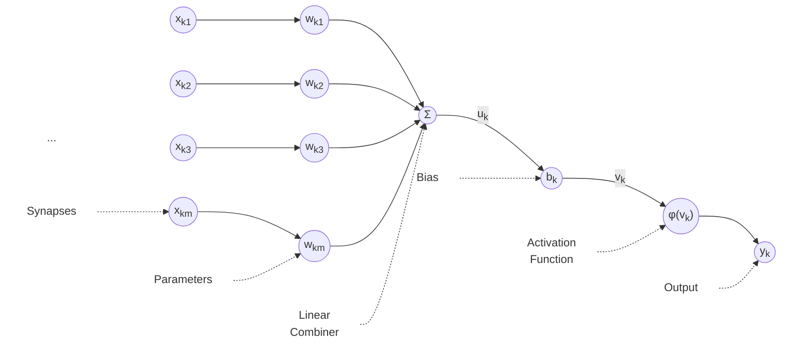

A neuron is the basic information processing unit in a neural network.
There are five basic elements in a neuron. A neuron is denoted as **k**.

#Synapses

A **synapse** is basically an input signal to your neuron. A synapse is also known as a **connecting link**. Every neuron in a neural network expects a set of synapses.

A synapse is denoted as **$x_{kj}$** , where _k_ represents the neuron and _j_ represents the index of the synapse. The total number of synapses accepted by a neuron is denoted by **m**.