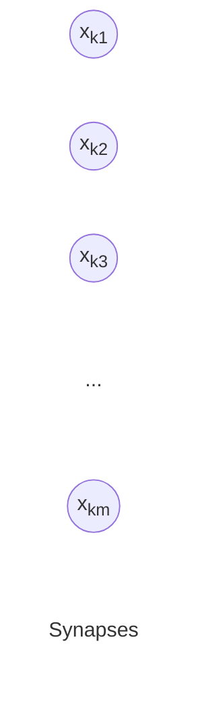
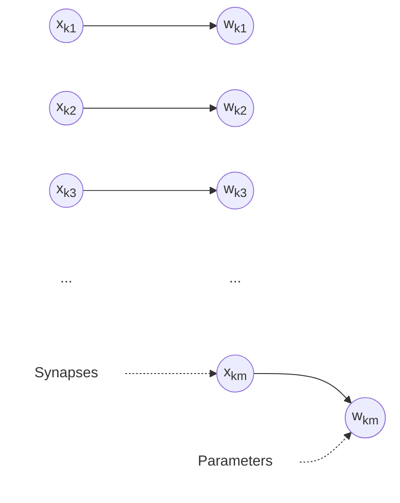
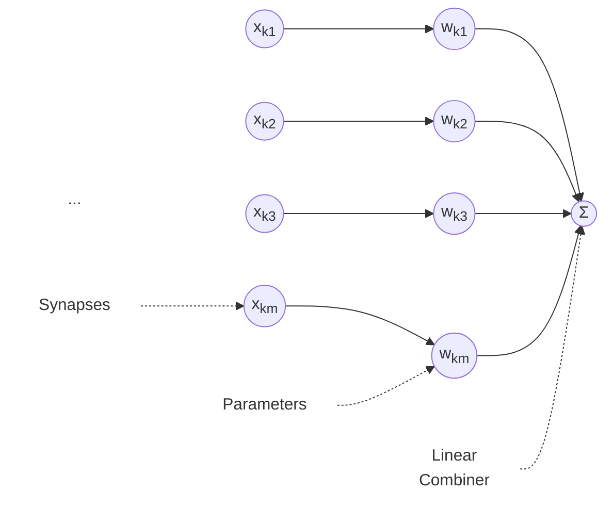
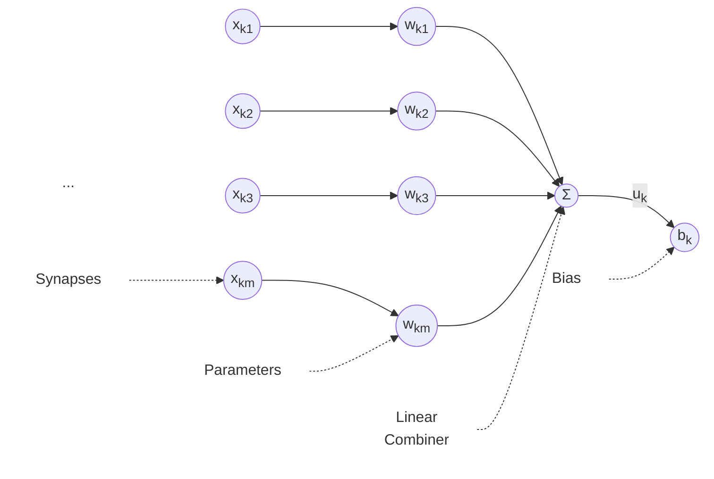
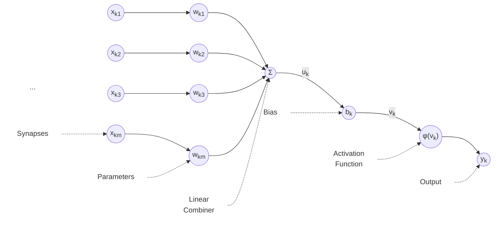
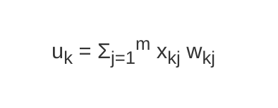
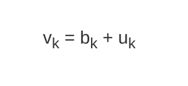
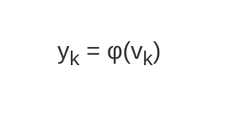

A neuron is the basic information processing unit in a neural network.
There are five basic elements in a neuron. A neuron is denoted as **k**.

## Synapses

A **synapse** is basically an ==input signal to your neuron==. A synapse is also known as a **connecting link**. Every neuron in a neural network expects a set of synapses. In the brain, a synapse is the physical gap and connection point through which one neuron passes a signal to another. In an artificial neural network, this connection is represented mathematically as a **weight**. 

A synapse is denoted as **$x_{kj}$** , where _k_ represents the neuron and _j_ represents the index of the synapse. The total number of synapses accepted by a neuron is denoted by **m**. 

## Parameter

A synapse is multiplied with a corresponding special value known as **parameter** or **weight**. The parameter is determined during the learning phase from your training set. In a neuron with **m** synapses, there are **m** parameters. In other words, every synapse has a corresponding parameter. It should be noted that parameters can occur within intervals such as **[-1, 1]** or **[0, 1].**

In machine learning, a "parameter" is any configuration variable that is internal to the model and whose value can be estimated from data. Parameters encompass **both weights and biases**.

A parameter is denoted as **$w_{kj}$**, where _k_ represents the neuron and _j_ represents the index of the parameter. The total number of parameters is equal to the total number of synapses.

## Linear Combiner

After the synapses are multiplied with their respective parameters, they are all added together at the summing junction, which is also known as the linear combiner.  Or Simply a **linear combiner** in a neural network is ==the summing junction of a neuron==.
  
The output of the summing junction is denoted as **$u_{kj}$**, where _k_ represents the neuron.

## Bias

An external value known as **bias** is added to the output of the summing junction. The newly evaluated value is known as the **induced local field** or **activation potential**. The bias either increases or decreases the result of the summing junction. . 

It acts just like the y-intercept (`c`) in a basic linear equation like y = mx + c

When the values of the induced local field and the output of the summing junction are plotted on a graph, an _affine transformation_ is observed because of the presence of the bias value. In other words, the plotted graph does not pass through the origin.  
  
The bias is denoted as **$b_{kj}$**. The induced local field or activation potential is denoted as **$v_{kj}$**.

### Reasons to add Bias after Linear Combiner 

- **Shifts the activation:** It moves the activation function left or right (or up and down) on a graph. 

- **Prevents zero-lock:** Without a bias, if all inputs are zero, the combined output is always zero. This forces the model to only learn patterns that pass directly through the origin. 

- **Adds flexibility:** A bias gives the neuron the freedom to fire or stay dormant based on a custom threshold, helping the network fit real-world data accurately.

## Activation Function

A special function known as the **activation function** limits the amplitude of the output of the neuron. It takes that combined value (z = w ⋅ x + b) and transforms it to add **non-linearity** to the network.  In other words, it normalizes the output to an interval such as **[0, 1]** or **[-1, 1]**.

Without an activation function, stacking multiple layers just acts like a single basic linear equation, meaning the network couldn't learn complex shapes, images, or patterns. 

The activation function is denoted as **φ**.

## Mathematical Equations

The above statements can be written mathematically as follows.

This equation represents the output of the summing junction, it basically adds the products of the synapses and parameters of the neuron.

This equation represents the induced local field or activation potential. It is basically the sum of the bias and the output of the summing junction.

The output of the neuron is equal to the result of applying the activation function to the induced local field.