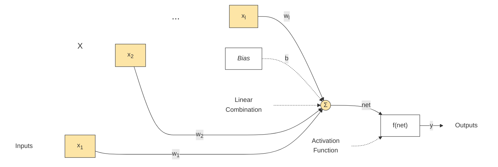
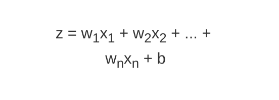
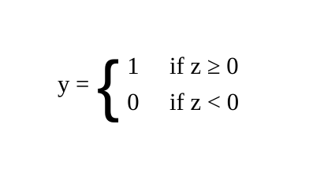

A perceptron is ==the simplest type of artificial neural network and a foundational algorithm for binary classification==.

## Introduction 

The perceptron is one of the simplest and foundational building blocks of neural networks. Developed by Frank Rosenblatt in the 1950s, it is a type of artificial neuron used for binary classification tasks. Despite its simplicity, the perceptron has paved the way for the development of more complex neural network architectures. This article explores the perceptron, its structure, functioning, and significance in the realm of neural networks.

## What is a Perceptron?

A perceptron is a ==single-layer neural network== that consists of a single neuron. Its primary purpose is to classify input data into one of two classes. It performs this classification by learning a decision boundary that separates the two classes.

## Structure of a Perceptron

  
A perceptron consists of the following components:

1. **Inputs (x1, x2, …, xn)**: These are the features or attributes of the input data. Each input is associated with a weight.
2. **Weights (w1, w2, …, wn)**: These are parameters that determine the importance of each input. Weights are adjusted during the training process.
3. **Bias (b)**: The bias is an additional parameter that allows the decision boundary to be shifted. It helps in making the perceptron more flexible.
4. **Activation Function**: The perceptron uses a step function (or Heaviside step function) as its activation function. This function produces a binary output (0 or 1) based on whether the weighted sum of inputs exceeds a certain threshold.
5. **Output (y)**: This is the result of the perceptron’s computation. It represents the class to which the input data belongs.




## How Does a Perceptron Work?

  
The perceptron performs the following steps:

**Weighted Sum**: Calculate the weighted sum of the inputs plus the bias. Mathematically, this is represented as:


**Activation Function**: Apply the activation function to the weighted sum. The step function is defined as:


**Output**: The result of the activation function is the perceptron’s output, which indicates the class of the input data.

## Training the Perceptron

Training a perceptron involves adjusting the weights and bias based on the errors made during classification. The most commonly used algorithm for training a perceptron is the Perceptron Learning Algorithm. The training process involves the following steps:

1. **Initialize Weights and Bias**: Set initial values for the weights and bias, usually to small random numbers.
2. **Compute Output**: For each training example, compute the weighted sum and apply the activation function to get the output.
3. **Update Weights and Bias**: If the output is incorrect, update the weights and bias using the following update rules:

```mermaid
graph TD
    Eq1["w<sub>i</sub> = w<sub>i</sub> + Δw<sub>i</sub>"]
    Eq2["Δw<sub>i</sub> = η · (y<sub>true</sub> - y<sub>pred</sub>) · x<sub>i</sub>"]
    Eq3["b = b + η · (y<sub>true</sub> - y<sub>pred</sub>)"]
    Text["<div style='white-space: nowrap;'>Here, η is the learning rate, y<sub>true</sub> is the actual label, and y<sub>pred</sub> is the predicted label.</div>"]

    Eq1 ~~~ Eq2
    Eq2 ~~~ Eq3
    Eq3 ~~~ Text

    style Eq1 fill:transparent, stroke:transparent, font-family:serif
    style Eq2 fill:transparent, stroke:transparent, font-family:serif
    style Eq3 fill:transparent, stroke:transparent, font-family:serif
    style Text fill:transparent, stroke:transparent
```

4. **Repeat**: Iterate through the training data multiple times until the perceptron converges and the classification errors are minimized.

## Limitations of the Perceptron

While the perceptron is a fundamental building block of neural networks, it has some limitations:

1. **Linearly Separable Data**: The perceptron can only solve problems where the classes are linearly separable. For example, it cannot solve the XOR problem, where the classes are not linearly separable.
2. **Single-Layer Network**: As a single-layer network, the perceptron has limited capacity and cannot capture complex patterns in data.

## The Role of Perceptron in Neural Networks

Despite its limitations, the perceptron is significant in the context of neural networks for several reasons:

1. **Foundation for Multi-Layer Networks**: The perceptron is a building block for more complex neural network architectures. Multi-layer networks, such as multi-layer perceptrons (MLPs), consist of multiple layers of perceptrons and can learn non-linear decision boundaries.
2. **Introduction to Training Algorithms**: The perceptron learning algorithm introduced concepts that are fundamental to the training of more advanced neural networks, including gradient descent and weight adjustment.
3. **Inspiration for Modern Neural Networks**: The perceptron laid the groundwork for the development of modern neural network models, such as deep learning networks, convolutional neural networks (CNNs), and recurrent neural networks (RNNs).

## Conclusion

The perceptron is a simple yet powerful concept in the field of neural networks. It provides the foundation for understanding more complex neural network architectures and training algorithms. By grasping the principles of the perceptron, one gains insight into the evolution of neural networks and their applications in solving complex problems. Despite its simplicity, the perceptron remains a cornerstone of neural network theory and practice.